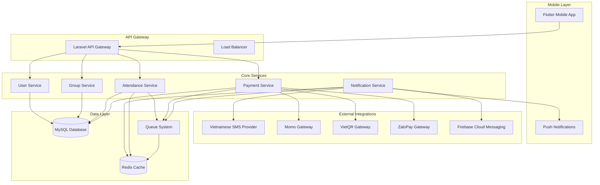
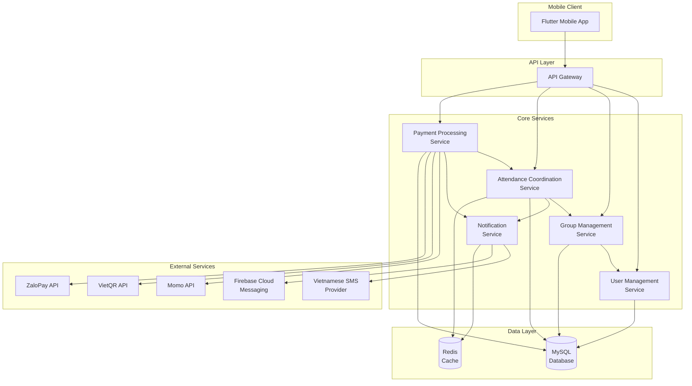
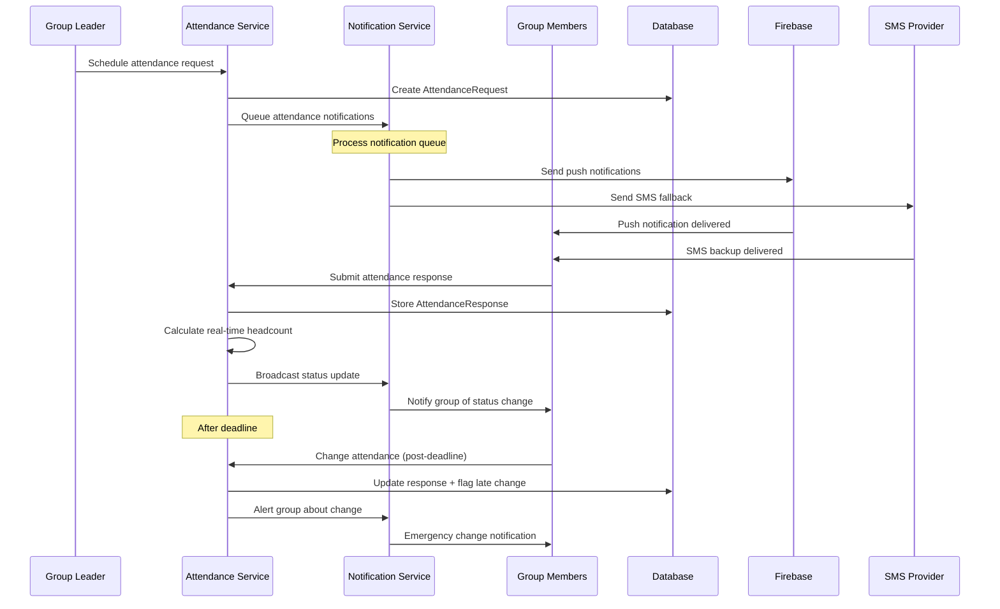
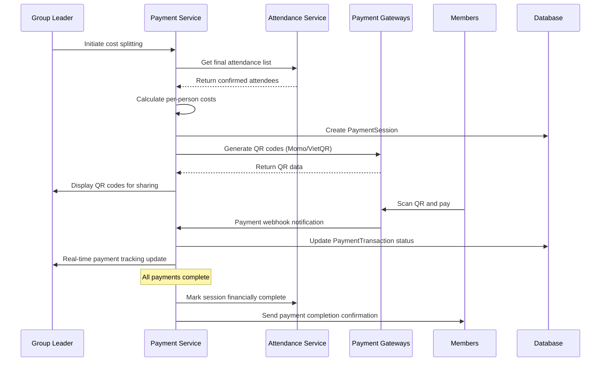
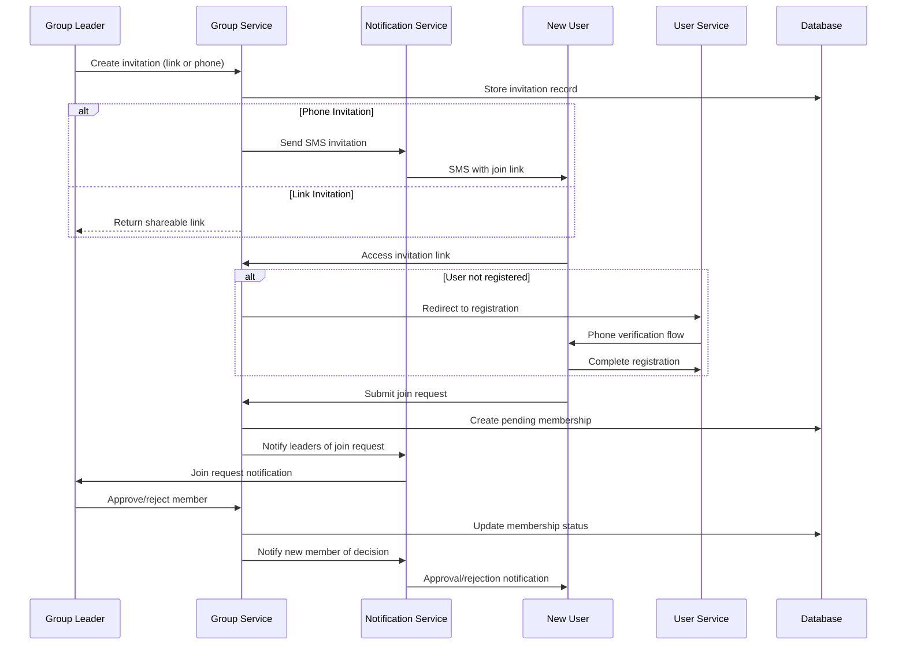

# Go Sport App Architecture Document

## Introduction

This document outlines the overall project architecture for Go Sport App, including backend systems, shared services, and non-UI specific concerns. Its primary goal is to serve as the guiding architectural blueprint for AI-driven development, ensuring consistency and adherence to chosen patterns and technologies.

**Relationship to Frontend Architecture:**
If the project includes a significant user interface, a separate Frontend Architecture Document will detail the frontend-specific design and MUST be used in conjunction with this document. Core technology stack choices documented herein (see "Tech Stack") are definitive for the entire project, including any frontend components.

### Starter Template or Existing Project

**Decision:** N/A - Completely greenfield project

Based on analysis of the PRD and project brief, Go Sport App is a greenfield project that does not use any starter template. We will design the architecture from scratch with the Flutter + Laravel stack specified in PRD Technical Assumptions.

### Change Log

| Date | Version | Description | Author |
|------|---------|-------------|--------|
| 2025-08-28 | v1.0 | Initial architecture creation | Winston (Architect) |

## High Level Architecture

### Technical Summary

Go Sport App follows a **microservices-within-monorepo architecture** combining Flutter mobile frontend với Laravel backend services. The system emphasizes Vietnamese market requirements through integrated local payment gateways (Momo, VietQR, ZaloPay), SMS-based authentication, and culturally-aware notification patterns. Core architectural patterns include event-driven communication for real-time attendance updates, role-based access control across all services, and queue-based background processing for reliable notification delivery supporting Vietnamese mobile network conditions.

### High Level Overview

**Architecture Style:** Microservices within Monorepo
- **Repository Structure:** Single monorepo với `/mobile-app` (Flutter), `/api` (Laravel services), `/shared` (documentation, assets)
- **Service Architecture:** Separate Laravel services for user management, notifications, payments while maintaining unified codebase
- **Primary User Flow:** Mobile-first notification-driven workflow → attendance response → real-time group coordination → automated payment splitting

**Key Architectural Decisions:**
1. **Monorepo approach** enables atomic releases of frontend/backend changes critical for attendance notification reliability
2. **Microservices separation** allows independent scaling of high-traffic components (notifications, payments)
3. **Event-driven patterns** support real-time attendance updates across multiple group members
4. **Vietnamese-first integration** prioritizes local payment methods and SMS providers over international alternatives

### High Level Project Diagram



### Architectural and Design Patterns

- **Event-Driven Architecture:** Using Laravel Events/Listeners for attendance changes, payment updates - _Rationale:_ Enables real-time updates across group members and decouples service interactions
- **Repository Pattern:** Abstract data access logic across all services - _Rationale:_ Enables comprehensive testing and potential future database migrations for scaling
- **Command Query Responsibility Segregation (CQRS):** Separate read/write models for attendance data - _Rationale:_ Optimizes real-time attendance queries while maintaining data consistency
- **Circuit Breaker Pattern:** For Vietnamese payment gateway integrations - _Rationale:_ Provides resilience against payment provider outages common in developing markets
- **Queue-based Processing:** Laravel queues with Redis backing for notifications - _Rationale:_ Ensures reliable message delivery despite Vietnamese mobile network inconsistencies
 - **Dependency Injection (Flutter):** get_it + injectable for compile-time DI; Cubits obtain services via DI rather than global singletons - _Rationale:_ Explicit wiring, easy testing/mocking, minimal runtime overhead
 - **MVVM Presentation (Flutter):** One ViewModel per screen implemented as Cubit with Freezed union state; Widgets dispatch intents and render from state only - _Rationale:_ Separation of concerns, predictable state, high testability
 - **Typed Routing (Flutter):** AutoRoute with code generation and guards - _Rationale:_ Safer navigation, deep link support, easier refactors

## Tech Stack

### Cloud Infrastructure
- **Provider:** AWS (Primary), DigitalOcean (Cost optimization)
- **Key Services:** EC2, RDS, ElastiCache, SQS, CloudWatch
- **Deployment Regions:** Asia Pacific (Singapore) for Vietnamese market latency

### Technology Stack Table

| Category | Technology | Version | Purpose | Rationale |
|----------|------------|---------|---------|-----------|
| **Mobile Framework** | Flutter | 3.27+ | Cross-platform mobile development | Strong Vietnamese developer community, single codebase for iOS/Android |
| **Presentation Pattern** | MVVM (Cubit-based ViewModels) | N/A | View-model boundary for UI | Testable, clear intent/state flow, separation of concerns |
| **Mobile State** | Cubit (flutter_bloc) | 9.x | Lightweight predictable state | Simple mental model, wide community adoption, testable |
| **Mobile Routing** | AutoRoute | 7.x+ | Typed, declarative navigation with codegen | Guards, deep links, safe refactors, reduced boilerplate |
| **State/Data Classes** | Freezed (+ freezed_annotation) | 2.x | Immutable models and union states | Concise APIs, copyWith, equality, sealed unions for Cubit states |
| **Dependency Injection** | get_it + injectable | 7.x / 2.x | DI container with codegen | Clear dependency graph, testable Cubits/services, minimal boilerplate |
### Frontend Presentation Pattern (MVVM)

- **Structure:** One Cubit per screen acting as the ViewModel. ViewModels expose intent methods (e.g., `submitPhone`, `verifyCode`, `createGroup`) and emit Freezed union states. Widgets are passive: they dispatch intents and render from state.
- **Dependency Injection:** ViewModels and services are constructed via `get_it` + `injectable`. No global singletons or service lookups inside Widgets.
- **Navigation:** Navigation is handled by the UI in response to state using AutoRoute typed routes and guards. ViewModels do not call Navigator directly.
- **Testing:** Unit-test ViewModels for state transitions and error paths. Widget tests assert UI reacts correctly to state changes and guard redirects.

| **Backend Language** | PHP | 8.3 | Server-side development | Team expertise from PRD, mature Vietnamese development ecosystem |
| **Backend Framework** | Laravel | 12.0 | API and service development | Robust ecosystem, built-in queue system, excellent Vietnamese community |
| **Database** | MySQL | 8.0 | Primary data storage | ACID compliance for financial data, strong Laravel integration |
| **Cache/Sessions** | Redis | 7.2 | Caching and queue backend | High-performance data structure store, queue reliability |
| **Queue System** | Laravel Queues | 11.0 | Background job processing | Native Laravel integration, Redis-backed reliability |
| **API Documentation** | Swagger/OpenAPI | 3.0 | API specification | Standardized documentation for AI agent development |
| **Authentication** | Laravel Sanctum | 4.0 | API token management | Lightweight SPA authentication, mobile-optimized |
| **Payment Integration** | Momo API | Latest | Vietnamese mobile payments | Market leader in Vietnam, excellent mobile UX |
| **Payment Integration** | VietQR | Latest | Banking QR standards | Universal bank compatibility in Vietnam |
| **SMS Provider** | Viettel SMS | Latest | Phone verification | Reliable Vietnamese network coverage |
| **Push Notifications** | Firebase Cloud Messaging | Latest | Real-time mobile notifications | Cross-platform support, reliable delivery |
| **Containerization** | Docker | 24.0 | Development environment | Consistent development setup, easy Vietnamese developer onboarding |
| **Web Server** | Nginx | 1.24 | Reverse proxy and static files | High performance, Laravel optimization |
| **Process Manager** | Supervisor | 4.2 | Queue worker management | Reliable Laravel queue worker supervision |

## Data Models

### User Model
**Purpose:** Core user authentication and profile management with Vietnamese phone-based registration

**Key Attributes:**
- id: UUID - Unique identifier
- phone_number: string - Vietnamese format (+84, 0x), encrypted storage
- name: string - Full name supporting Vietnamese diacritics
- password: string - Hashed password for optional password auth
- email: string (nullable) - Optional email for notifications
- preferred_sports: JSON - Array of sports preferences
- verified_at: timestamp - Phone verification completion
- created_at: timestamp - Registration date

**Relationships:**
- HasMany: GroupMemberships (role assignments in groups)
- HasMany: AttendanceResponses (historical attendance data)
- HasMany: PaymentTransactions (payment history)

### Group Model
**Purpose:** Sports group management with Vietnamese cultural settings and role hierarchies

**Key Attributes:**
- id: UUID - Unique identifier
- name: string - Group name with Vietnamese character support
- sport_type: enum - cầu lông, pickleball, bóng đá
- minimum_players: integer - Required headcount for games
- default_location: string - Usual playing venue
- notification_timing: JSON - Customizable reminder schedules
- visibility: enum - public, private, invitation_only
- settings: JSON - Flexible group configuration storage

**Relationships:**
- HasMany: GroupMemberships (member roles and permissions)
- HasMany: AttendanceRequests (game attendance coordination)
- HasMany: PaymentSessions (cost splitting instances)

### GroupMembership Model
**Purpose:** Role-based access control linking users to groups with Vietnamese hierarchy (Trưởng nhóm, Phó nhóm, Thành viên, Khách)

**Key Attributes:**
- id: UUID - Unique identifier
- user_id: UUID - Foreign key to User
- group_id: UUID - Foreign key to Group
- role: enum - truong_nhom, pho_nhom, thanh_vien, khach
- joined_at: timestamp - Membership start date
- approved_by: UUID - Foreign key to approving user
- status: enum - pending, approved, declined, removed

**Relationships:**
- BelongsTo: User (member details)
- BelongsTo: Group (group membership)
- BelongsTo: ApprovedBy User (audit trail)

### AttendanceRequest Model
**Purpose:** Game session coordination with notification scheduling and response tracking

**Key Attributes:**
- id: UUID - Unique identifier
- group_id: UUID - Foreign key to Group
- game_datetime: timestamp - Scheduled game time
- notification_sent_at: timestamp - Notification delivery tracking
- response_deadline: timestamp - Cutoff for responses
- minimum_required: integer - Minimum players needed
- location: string - Game venue for this session
- status: enum - pending, confirmed, cancelled, completed

**Relationships:**
- BelongsTo: Group (associated sports group)
- HasMany: AttendanceResponses (member responses)
- HasOne: PaymentSession (cost splitting for confirmed games)

### AttendanceResponse Model
**Purpose:** Member attendance responses with change tracking and real-time updates

**Key Attributes:**
- id: UUID - Unique identifier
- attendance_request_id: UUID - Foreign key to AttendanceRequest
- user_id: UUID - Foreign key to User
- response: enum - attending, not_attending, maybe
- responded_at: timestamp - Response submission time
- changed_after_deadline: boolean - Late change tracking
- change_reason: string (nullable) - Optional explanation for changes

**Relationships:**
- BelongsTo: AttendanceRequest (game session)
- BelongsTo: User (responding member)

### PaymentSession Model
**Purpose:** Cost splitting and QR code generation based on attendance with Vietnamese payment methods

**Key Attributes:**
- id: UUID - Unique identifier
- attendance_request_id: UUID - Foreign key to AttendanceRequest
- total_cost: decimal(10,2) - Total expenses for session
- cost_breakdown: JSON - Itemized expenses (venue, equipment, etc.)
- per_person_amount: decimal(10,2) - Calculated individual cost
- qr_code_data: TEXT - Generated QR payment information
- created_by: UUID - Foreign key to User (usually group leader)

**Relationships:**
- BelongsTo: AttendanceRequest (associated game)
- BelongsTo: CreatedBy User (payment initiator)
- HasMany: PaymentTransactions (individual payments)

### PaymentTransaction Model
**Purpose:** Individual payment tracking with Vietnamese gateway integration and status monitoring

**Key Attributes:**
- id: UUID - Unique identifier
- payment_session_id: UUID - Foreign key to PaymentSession
- user_id: UUID - Foreign key to User
- amount: decimal(10,2) - Payment amount
- payment_method: enum - momo, vietqr, zalopay
- gateway_transaction_id: string - External payment reference
- status: enum - pending, completed, failed, refunded
- completed_at: timestamp (nullable) - Payment completion time

**Relationships:**
- BelongsTo: PaymentSession (cost splitting session)
- BelongsTo: User (paying member)

## Components

### User Management Service
**Responsibility:** Handle Vietnamese phone-based registration, SMS verification, authentication, and user profile management

**Key Interfaces:**
- POST /api/auth/register - Phone number registration with SMS verification
- POST /api/auth/verify - SMS code verification and account activation
- POST /api/auth/login - Authentication via phone/password or SMS
- GET/PUT /api/user/profile - User profile management with Vietnamese character support

**Dependencies:** Vietnamese SMS Provider, Laravel Sanctum, MySQL User tables

**Technology Stack:** Laravel 11.0, MySQL 8.0, Redis caching, Vietnamese SMS API integration

### Group Management Service
**Responsibility:** Sports group creation, member invitation system, role-based access control, and Vietnamese cultural group settings

**Key Interfaces:**
- POST /api/groups - Create sports group with Vietnamese settings
- POST /api/groups/{id}/invite - Generate invitation links or send SMS invites
- PUT /api/groups/{id}/members/{user_id}/role - Role assignment and modification
- GET /api/groups/{id}/members - Member list with roles and activity status

**Dependencies:** User Management Service, Notification Service, MySQL Group tables

**Technology Stack:** Laravel 11.0, MySQL 8.0, Event broadcasting for real-time updates

### Attendance Coordination Service
**Responsibility:** Automated notification scheduling, attendance response collection, real-time headcount tracking, and post-deadline change management

**Key Interfaces:**
- POST /api/attendance/request - Schedule attendance notifications for games
- POST /api/attendance/{id}/respond - Submit attendance responses
- GET /api/attendance/{id}/status - Real-time attendance status and headcount
- PUT /api/attendance/{id}/change - Post-deadline attendance changes

**Dependencies:** Group Management Service, Notification Service, Redis for real-time data

**Technology Stack:** Laravel 11.0, Redis 7.2, Laravel Events for real-time updates, Queue system

### Payment Processing Service
**Responsibility:** Vietnamese payment gateway integration (Momo, VietQR, ZaloPay), cost calculation based on attendance, QR code generation, and transaction monitoring

**Key Interfaces:**
- POST /api/payments/session - Create payment session with cost splitting
- POST /api/payments/{id}/generate-qr - Generate QR codes for Vietnamese payment methods
- GET /api/payments/{id}/status - Real-time payment completion tracking
- POST /api/payments/webhook - Handle payment gateway callbacks

**Dependencies:** Attendance Service, Momo API, VietQR API, ZaloPay API

**Technology Stack:** Laravel 11.0, Vietnamese payment gateway SDKs, Queue processing for webhooks

### Notification Service
**Responsibility:** Multi-channel notification delivery (push notifications, SMS), Vietnamese network optimization, and delivery reliability

**Key Interfaces:**
- POST /api/notifications/attendance - Send attendance notifications
- POST /api/notifications/payment - Send payment reminders
- POST /api/notifications/group - Send group-related updates
- GET /api/notifications/delivery-status - Track notification delivery

**Dependencies:** Firebase Cloud Messaging, Vietnamese SMS Provider, Redis for delivery tracking

**Technology Stack:** Laravel 11.0, FCM integration, Vietnamese SMS API, Queue system with retry logic

### Component Diagrams



## External APIs

### Momo Payment Gateway API
- **Purpose:** Vietnamese mobile payment processing for cost splitting
- **Documentation:** https://developers.momo.vn/v3/
- **Base URL(s):** https://payment.momo.vn/v2/gateway/api/
- **Authentication:** HMAC-SHA256 signature with merchant credentials
- **Rate Limits:** 1000 requests/minute per merchant

**Key Endpoints Used:**
- `POST /create` - Create payment transaction with QR code generation
- `POST /query` - Query transaction status for real-time tracking
- `POST /refund` - Process refunds for cancelled games

**Integration Notes:** Requires Vietnamese business registration and Momo merchant approval process

### VietQR Standard API
- **Purpose:** Universal banking QR code generation for wide payment acceptance
- **Documentation:** https://www.vietqr.io/developer
- **Base URL(s):** https://api.vietqr.io/v2/
- **Authentication:** API key-based authentication
- **Rate Limits:** 500 requests/minute

**Key Endpoints Used:**
- `POST /generate` - Generate banking QR codes with payment amounts
- `GET /banks` - Retrieve supported Vietnamese bank list

**Integration Notes:** Integrates with all major Vietnamese banking apps through standardized QR format

### ZaloPay Gateway API
- **Purpose:** Alternative Vietnamese payment method integration
- **Documentation:** https://docs.zalopay.vn/
- **Base URL(s):** https://openapi.zalopay.vn/v2/
- **Authentication:** RSA signature with merchant keys
- **Rate Limits:** 2000 requests/minute per merchant

**Key Endpoints Used:**
- `POST /create` - Create ZaloPay payment orders
- `POST /query` - Check payment status and completion

**Integration Notes:** Popular among younger Vietnamese users, requires ZaloPay merchant account

### Vietnamese SMS Provider API
- **Purpose:** Phone verification and notification SMS delivery
- **Documentation:** TBD - Select based on coverage and pricing analysis
- **Base URL(s):** TBD based on provider selection (Viettel/VinaPhone/MobiFone)
- **Authentication:** API key or OAuth2 depending on provider
- **Rate Limits:** Varies by provider and plan

**Key Endpoints Used:**
- `POST /send` - Send verification codes and notifications
- `GET /delivery-report` - Track SMS delivery status

**Integration Notes:** Must ensure compliance with Vietnamese telecommunications regulations

### Firebase Cloud Messaging (FCM)
- **Purpose:** Cross-platform push notifications for real-time attendance updates
- **Documentation:** https://firebase.google.com/docs/cloud-messaging/
- **Base URL(s):** https://fcm.googleapis.com/v1/
- **Authentication:** OAuth2 with service account credentials
- **Rate Limits:** No explicit limits but subject to Firebase quotas

**Key Endpoints Used:**
- `POST /projects/{project-id}/messages:send` - Send targeted push notifications

**Integration Notes:** Integrated with Flutter Firebase SDK for optimal mobile performance

## Core Workflows

### Attendance Notification and Response Workflow



### Payment Generation and Processing Workflow



### Group Invitation and Approval Workflow



## REST API Spec

```yaml
openapi: 3.0.0
info:
  title: Go Sport App API
  version: 1.0.0
  description: Vietnamese sports group coordination API with attendance management and payment integration

servers:
  - url: https://api.gosport.vn/v1
    description: Production API server
  - url: https://staging-api.gosport.vn/v1
    description: Staging API server

security:
  - BearerAuth: []

paths:
  # Authentication Endpoints
  /auth/register:
    post:
      summary: Register with Vietnamese phone number
      requestBody:
        required: true
        content:
          application/json:
            schema:
              type: object
              properties:
                phone_number:
                  type: string
                  pattern: '^(\+84|84|0)[0-9]{9}$'
                  example: "+84901234567"
                name:
                  type: string
                  example: "Nguyễn Văn An"
                preferred_sports:
                  type: array
                  items:
                    type: string
                    enum: [cau_long, pickleball, bong_da]
      responses:
        '200':
          description: SMS verification code sent
        '400':
          description: Invalid phone number format

  /auth/verify:
    post:
      summary: Verify SMS code and activate account
      requestBody:
        required: true
        content:
          application/json:
            schema:
              type: object
              properties:
                phone_number:
                  type: string
                verification_code:
                  type: string
                  pattern: '^[0-9]{6}$'
      responses:
        '200':
          description: Account activated, returns auth token
          content:
            application/json:
              schema:
                type: object
                properties:
                  access_token:
                    type: string
                  user:
                    $ref: '#/components/schemas/User'

  # Group Management Endpoints
  /groups:
    post:
      summary: Create new sports group
      requestBody:
        required: true
        content:
          application/json:
            schema:
              $ref: '#/components/schemas/CreateGroupRequest'
      responses:
        '201':
          description: Group created successfully
          content:
            application/json:
              schema:
                $ref: '#/components/schemas/Group'

    get:
      summary: List user's groups with role information
      responses:
        '200':
          description: List of groups
          content:
            application/json:
              schema:
                type: object
                properties:
                  data:
                    type: array
                    items:
                      $ref: '#/components/schemas/GroupMembership'

  /groups/{groupId}/invite:
    post:
      summary: Generate invitation or send SMS invite
      parameters:
        - name: groupId
          in: path
          required: true
          schema:
            type: string
            format: uuid
      requestBody:
        required: true
        content:
          application/json:
            schema:
              type: object
              properties:
                type:
                  type: string
                  enum: [link, sms]
                phone_number:
                  type: string
                  description: Required for SMS invitations
                expires_in:
                  type: integer
                  description: Hours until expiration (1-168)
      responses:
        '200':
          description: Invitation created
          content:
            application/json:
              schema:
                type: object
                properties:
                  invitation_link:
                    type: string
                  expires_at:
                    type: string
                    format: date-time

  # Attendance Management Endpoints
  /attendance/request:
    post:
      summary: Create attendance request for game
      requestBody:
        required: true
        content:
          application/json:
            schema:
              $ref: '#/components/schemas/CreateAttendanceRequest'
      responses:
        '201':
          description: Attendance request created and notifications scheduled

  /attendance/{requestId}/respond:
    post:
      summary: Submit attendance response
      parameters:
        - name: requestId
          in: path
          required: true
          schema:
            type: string
            format: uuid
      requestBody:
        required: true
        content:
          application/json:
            schema:
              type: object
              properties:
                response:
                  type: string
                  enum: [attending, not_attending, maybe]
      responses:
        '200':
          description: Response recorded successfully

  /attendance/{requestId}/status:
    get:
      summary: Get real-time attendance status
      parameters:
        - name: requestId
          in: path
          required: true
          schema:
            type: string
            format: uuid
      responses:
        '200':
          description: Current attendance status
          content:
            application/json:
              schema:
                $ref: '#/components/schemas/AttendanceStatus'

  # Payment Processing Endpoints
  /payments/session:
    post:
      summary: Create payment session for cost splitting
      requestBody:
        required: true
        content:
          application/json:
            schema:
              type: object
              properties:
                attendance_request_id:
                  type: string
                  format: uuid
                total_cost:
                  type: number
                  format: decimal
                cost_breakdown:
                  type: object
                  properties:
                    venue:
                      type: number
                    equipment:
                      type: number
      responses:
        '201':
          description: Payment session created

  /payments/{sessionId}/generate-qr:
    post:
      summary: Generate QR codes for Vietnamese payment methods
      parameters:
        - name: sessionId
          in: path
          required: true
          schema:
            type: string
            format: uuid
      requestBody:
        required: true
        content:
          application/json:
            schema:
              type: object
              properties:
                payment_methods:
                  type: array
                  items:
                    type: string
                    enum: [momo, vietqr, zalopay]
      responses:
        '200':
          description: QR codes generated
          content:
            application/json:
              schema:
                type: object
                properties:
                  qr_codes:
                    type: object
                    properties:
                      momo:
                        type: string
                        description: Momo QR code data
                      vietqr:
                        type: string
                        description: VietQR code data

components:
  securitySchemes:
    BearerAuth:
      type: http
      scheme: bearer
      bearerFormat: JWT

  schemas:
    User:
      type: object
      properties:
        id:
          type: string
          format: uuid
        phone_number:
          type: string
        name:
          type: string
        preferred_sports:
          type: array
          items:
            type: string

    Group:
      type: object
      properties:
        id:
          type: string
          format: uuid
        name:
          type: string
        sport_type:
          type: string
          enum: [cau_long, pickleball, bong_da]
        minimum_players:
          type: integer
        member_count:
          type: integer

    CreateGroupRequest:
      type: object
      required:
        - name
        - sport_type
        - minimum_players
      properties:
        name:
          type: string
        sport_type:
          type: string
          enum: [cau_long, pickleball, bong_da]
        minimum_players:
          type: integer
        default_location:
          type: string
        notification_timing:
          type: object

    GroupMembership:
      type: object
      properties:
        group:
          $ref: '#/components/schemas/Group'
        role:
          type: string
          enum: [truong_nhom, pho_nhom, thanh_vien, khach]
        joined_at:
          type: string
          format: date-time

    CreateAttendanceRequest:
      type: object
      required:
        - group_id
        - game_datetime
        - response_deadline
      properties:
        group_id:
          type: string
          format: uuid
        game_datetime:
          type: string
          format: date-time
        response_deadline:
          type: string
          format: date-time
        location:
          type: string
        minimum_required:
          type: integer

    AttendanceStatus:
      type: object
      properties:
        headcount:
          type: integer
        minimum_required:
          type: integer
        status:
          type: string
          enum: [pending, confirmed, at_risk, cancelled]
        responses:
          type: array
          items:
            type: object
            properties:
              user:
                $ref: '#/components/schemas/User'
              response:
                type: string
                enum: [attending, not_attending, maybe]
              responded_at:
                type: string
                format: date-time
```

## Database Schema

```sql
-- Users table with Vietnamese phone-based registration
CREATE TABLE users (
    id CHAR(36) PRIMARY KEY,
    phone_number VARCHAR(20) UNIQUE NOT NULL,
    phone_number_encrypted TEXT NOT NULL, -- Encrypted storage for compliance
    name VARCHAR(100) NOT NULL,
    email VARCHAR(255) NULL,
    password VARCHAR(255) NULL, -- Optional password auth
    preferred_sports JSON NULL,
    verified_at TIMESTAMP NULL,
    created_at TIMESTAMP DEFAULT CURRENT_TIMESTAMP,
    updated_at TIMESTAMP DEFAULT CURRENT_TIMESTAMP ON UPDATE CURRENT_TIMESTAMP,
    INDEX idx_phone_number (phone_number),
    INDEX idx_verified_at (verified_at)
) ENGINE=InnoDB CHARSET=utf8mb4 COLLATE=utf8mb4_unicode_ci;

-- Sports groups with Vietnamese cultural settings
CREATE TABLE groups (
    id CHAR(36) PRIMARY KEY,
    name VARCHAR(100) NOT NULL,
    sport_type ENUM('cau_long', 'pickleball', 'bong_da') NOT NULL,
    minimum_players INTEGER NOT NULL DEFAULT 4,
    default_location VARCHAR(255) NULL,
    notification_timing JSON NULL, -- Flexible timing configuration
    visibility ENUM('public', 'private', 'invitation_only') DEFAULT 'private',
    settings JSON NULL, -- Additional group-specific settings
    created_by CHAR(36) NOT NULL,
    created_at TIMESTAMP DEFAULT CURRENT_TIMESTAMP,
    updated_at TIMESTAMP DEFAULT CURRENT_TIMESTAMP ON UPDATE CURRENT_TIMESTAMP,
    FOREIGN KEY (created_by) REFERENCES users(id) ON DELETE CASCADE,
    INDEX idx_sport_type (sport_type),
    INDEX idx_created_by (created_by),
    FULLTEXT idx_name_location (name, default_location)
) ENGINE=InnoDB CHARSET=utf8mb4 COLLATE=utf8mb4_unicode_ci;

-- Group membership with Vietnamese role hierarchy
CREATE TABLE group_memberships (
    id CHAR(36) PRIMARY KEY,
    user_id CHAR(36) NOT NULL,
    group_id CHAR(36) NOT NULL,
    role ENUM('truong_nhom', 'pho_nhom', 'thanh_vien', 'khach') NOT NULL,
    status ENUM('pending', 'approved', 'declined', 'removed') DEFAULT 'pending',
    approved_by CHAR(36) NULL,
    joined_at TIMESTAMP DEFAULT CURRENT_TIMESTAMP,
    updated_at TIMESTAMP DEFAULT CURRENT_TIMESTAMP ON UPDATE CURRENT_TIMESTAMP,
    FOREIGN KEY (user_id) REFERENCES users(id) ON DELETE CASCADE,
    FOREIGN KEY (group_id) REFERENCES groups(id) ON DELETE CASCADE,
    FOREIGN KEY (approved_by) REFERENCES users(id) ON DELETE SET NULL,
    UNIQUE KEY unique_user_group (user_id, group_id),
    INDEX idx_group_role (group_id, role),
    INDEX idx_user_groups (user_id),
    INDEX idx_status (status)
) ENGINE=InnoDB CHARSET=utf8mb4 COLLATE=utf8mb4_unicode_ci;

-- Attendance requests for game coordination
CREATE TABLE attendance_requests (
    id CHAR(36) PRIMARY KEY,
    group_id CHAR(36) NOT NULL,
    game_datetime TIMESTAMP NOT NULL,
    notification_sent_at TIMESTAMP NULL,
    response_deadline TIMESTAMP NOT NULL,
    minimum_required INTEGER NOT NULL,
    location VARCHAR(255) NULL,
    status ENUM('pending', 'confirmed', 'cancelled', 'completed') DEFAULT 'pending',
    created_by CHAR(36) NOT NULL,
    created_at TIMESTAMP DEFAULT CURRENT_TIMESTAMP,
    updated_at TIMESTAMP DEFAULT CURRENT_TIMESTAMP ON UPDATE CURRENT_TIMESTAMP,
    FOREIGN KEY (group_id) REFERENCES groups(id) ON DELETE CASCADE,
    FOREIGN KEY (created_by) REFERENCES users(id) ON DELETE CASCADE,
    INDEX idx_game_datetime (game_datetime),
    INDEX idx_group_date (group_id, game_datetime),
    INDEX idx_deadline (response_deadline),
    INDEX idx_status (status)
) ENGINE=InnoDB CHARSET=utf8mb4 COLLATE=utf8mb4_unicode_ci;

-- Individual attendance responses with change tracking
CREATE TABLE attendance_responses (
    id CHAR(36) PRIMARY KEY,
    attendance_request_id CHAR(36) NOT NULL,
    user_id CHAR(36) NOT NULL,
    response ENUM('attending', 'not_attending', 'maybe') NOT NULL,
    responded_at TIMESTAMP DEFAULT CURRENT_TIMESTAMP,
    changed_after_deadline BOOLEAN DEFAULT FALSE,
    change_reason VARCHAR(500) NULL,
    updated_at TIMESTAMP DEFAULT CURRENT_TIMESTAMP ON UPDATE CURRENT_TIMESTAMP,
    FOREIGN KEY (attendance_request_id) REFERENCES attendance_requests(id) ON DELETE CASCADE,
    FOREIGN KEY (user_id) REFERENCES users(id) ON DELETE CASCADE,
    UNIQUE KEY unique_request_user (attendance_request_id, user_id),
    INDEX idx_response (response),
    INDEX idx_responded_at (responded_at),
    INDEX idx_changed_after_deadline (changed_after_deadline)
) ENGINE=InnoDB CHARSET=utf8mb4 COLLATE=utf8mb4_unicode_ci;

-- Payment sessions for cost splitting
CREATE TABLE payment_sessions (
    id CHAR(36) PRIMARY KEY,
    attendance_request_id CHAR(36) NOT NULL,
    total_cost DECIMAL(10,2) NOT NULL,
    cost_breakdown JSON NOT NULL, -- Itemized expenses
    per_person_amount DECIMAL(10,2) NOT NULL,
    qr_code_data TEXT NULL, -- Generated QR payment data
    status ENUM('pending', 'partial', 'completed', 'cancelled') DEFAULT 'pending',
    created_by CHAR(36) NOT NULL,
    created_at TIMESTAMP DEFAULT CURRENT_TIMESTAMP,
    updated_at TIMESTAMP DEFAULT CURRENT_TIMESTAMP ON UPDATE CURRENT_TIMESTAMP,
    FOREIGN KEY (attendance_request_id) REFERENCES attendance_requests(id) ON DELETE CASCADE,
    FOREIGN KEY (created_by) REFERENCES users(id) ON DELETE CASCADE,
    INDEX idx_attendance_request (attendance_request_id),
    INDEX idx_status (status)
) ENGINE=InnoDB CHARSET=utf8mb4 COLLATE=utf8mb4_unicode_ci;

-- Individual payment transactions with Vietnamese gateway integration
CREATE TABLE payment_transactions (
    id CHAR(36) PRIMARY KEY,
    payment_session_id CHAR(36) NOT NULL,
    user_id CHAR(36) NOT NULL,
    amount DECIMAL(10,2) NOT NULL,
    payment_method ENUM('momo', 'vietqr', 'zalopay', 'cash') NOT NULL,
    gateway_transaction_id VARCHAR(255) NULL, -- External payment reference
    status ENUM('pending', 'processing', 'completed', 'failed', 'refunded') DEFAULT 'pending',
    gateway_response JSON NULL, -- Store gateway callback data
    completed_at TIMESTAMP NULL,
    created_at TIMESTAMP DEFAULT CURRENT_TIMESTAMP,
    updated_at TIMESTAMP DEFAULT CURRENT_TIMESTAMP ON UPDATE CURRENT_TIMESTAMP,
    FOREIGN KEY (payment_session_id) REFERENCES payment_sessions(id) ON DELETE CASCADE,
    FOREIGN KEY (user_id) REFERENCES users(id) ON DELETE CASCADE,
    UNIQUE KEY unique_session_user (payment_session_id, user_id),
    INDEX idx_payment_method (payment_method),
    INDEX idx_status (status),
    INDEX idx_gateway_transaction_id (gateway_transaction_id),
    INDEX idx_completed_at (completed_at)
) ENGINE=InnoDB CHARSET=utf8mb4 COLLATE=utf8mb4_unicode_ci;

-- Invitations for group membership
CREATE TABLE group_invitations (
    id CHAR(36) PRIMARY KEY,
    group_id CHAR(36) NOT NULL,
    invitation_type ENUM('link', 'sms') NOT NULL,
    invitation_token VARCHAR(100) UNIQUE NOT NULL,
    target_phone_number VARCHAR(20) NULL, -- For SMS invitations
    invited_by CHAR(36) NOT NULL,
    expires_at TIMESTAMP NOT NULL,
    used_at TIMESTAMP NULL,
    used_by CHAR(36) NULL,
    created_at TIMESTAMP DEFAULT CURRENT_TIMESTAMP,
    FOREIGN KEY (group_id) REFERENCES groups(id) ON DELETE CASCADE,
    FOREIGN KEY (invited_by) REFERENCES users(id) ON DELETE CASCADE,
    FOREIGN KEY (used_by) REFERENCES users(id) ON DELETE SET NULL,
    INDEX idx_invitation_token (invitation_token),
    INDEX idx_group_id (group_id),
    INDEX idx_expires_at (expires_at),
    INDEX idx_target_phone (target_phone_number)
) ENGINE=InnoDB CHARSET=utf8mb4 COLLATE=utf8mb4_unicode_ci;

-- Notification delivery tracking
CREATE TABLE notification_logs (
    id CHAR(36) PRIMARY KEY,
    user_id CHAR(36) NOT NULL,
    notification_type VARCHAR(50) NOT NULL,
    channel ENUM('push', 'sms', 'email') NOT NULL,
    title VARCHAR(255) NOT NULL,
    content TEXT NOT NULL,
    metadata JSON NULL, -- Additional notification context
    delivery_status ENUM('pending', 'sent', 'delivered', 'failed', 'read') DEFAULT 'pending',
    sent_at TIMESTAMP NULL,
    delivered_at TIMESTAMP NULL,
    failed_reason VARCHAR(500) NULL,
    created_at TIMESTAMP DEFAULT CURRENT_TIMESTAMP,
    FOREIGN KEY (user_id) REFERENCES users(id) ON DELETE CASCADE,
    INDEX idx_user_type (user_id, notification_type),
    INDEX idx_delivery_status (delivery_status),
    INDEX idx_sent_at (sent_at),
    INDEX idx_created_at (created_at)
) ENGINE=InnoDB CHARSET=utf8mb4 COLLATE=utf8mb4_unicode_ci;

-- System configuration for Vietnamese localization
CREATE TABLE system_settings (
    id INT AUTO_INCREMENT PRIMARY KEY,
    setting_key VARCHAR(100) UNIQUE NOT NULL,
    setting_value JSON NOT NULL,
    description TEXT NULL,
    updated_at TIMESTAMP DEFAULT CURRENT_TIMESTAMP ON UPDATE CURRENT_TIMESTAMP,
    INDEX idx_setting_key (setting_key)
) ENGINE=InnoDB CHARSET=utf8mb4 COLLATE=utf8mb4_unicode_ci;

-- Insert default Vietnamese system settings
INSERT INTO system_settings (setting_key, setting_value, description) VALUES
('supported_sports', '["cau_long", "pickleball", "bong_da"]', 'List of supported sports in Vietnamese'),
('payment_methods', '["momo", "vietqr", "zalopay"]', 'Available Vietnamese payment methods'),
('notification_timing_presets', '{"evening": "18:00", "afternoon": "14:00", "morning": "08:00"}', 'Default notification timing options'),
('sms_provider_config', '{"provider": "viettel", "rate_limit": 10}', 'SMS provider configuration for Vietnamese market');
```

## Source Tree

```
go-sport/
├── README.md                           # Project overview and setup instructions
├── docker-compose.yml                  # Development environment setup
├── .env.example                       # Environment variables template
├── .gitignore                         # Git ignore rules
├── docs/                              # Project documentation
│   ├── api/                          # API documentation
│   ├── architecture.md               # This architecture document
│   ├── deployment.md                 # Deployment procedures
│   └── vietnamese-integration.md     # Vietnamese-specific integration notes
├── mobile-app/                       # Flutter mobile application
│   ├── pubspec.yaml                  # Flutter dependencies
│   ├── lib/
│   │   ├── main.dart                 # App entry point
│   │   ├── core/                     # Core utilities and configurations
│   │   │   ├── constants/
│   │   │   ├── network/              # API client and networking
│   │   │   ├── storage/              # Local storage and caching
│   │   │   └── utils/
│   │   ├── features/                 # Feature-based organization
│   │   │   ├── auth/                 # Vietnamese phone authentication
│   │   │   │   ├── data/
│   │   │   │   ├── domain/
│   │   │   │   └── presentation/
│   │   │   ├── groups/               # Group management
│   │   │   ├── attendance/           # Attendance coordination
│   │   │   ├── payments/             # Vietnamese payment integration
│   │   │   └── notifications/        # Push notification handling
│   │   ├── shared/                   # Shared widgets and components
│   │   └── l10n/                     # Vietnamese localization files
│   ├── android/                      # Android-specific configuration
│   ├── ios/                          # iOS-specific configuration
│   └── test/                         # Flutter unit and widget tests
├── api/                              # Laravel backend services
│   ├── composer.json                 # PHP dependencies
│   ├── artisan                       # Laravel CLI tool
│   ├── bootstrap/
│   ├── config/                       # Configuration files
│   │   ├── app.php
│   │   ├── database.php
│   │   ├── queue.php
│   │   ├── vietnamese-payments.php   # Payment gateway configuration
│   │   └── sms.php                   # Vietnamese SMS provider config
│   ├── database/
│   │   ├── migrations/               # Database schema migrations
│   │   ├── seeders/                  # Test data and initial setup
│   │   └── factories/                # Model factories for testing
│   ├── app/
│   │   ├── Console/                  # Artisan commands
│   │   ├── Events/                   # Laravel events for real-time features
│   │   ├── Exceptions/               # Custom exception handling
│   │   ├── Http/
│   │   │   ├── Controllers/          # API controllers
│   │   │   │   ├── Auth/
│   │   │   │   ├── Groups/
│   │   │   │   ├── Attendance/
│   │   │   │   └── Payments/
│   │   │   ├── Middleware/           # Custom middleware (CORS, auth, etc.)
│   │   │   ├── Requests/             # Form request validation
│   │   │   └── Resources/            # API resource transformers
│   │   ├── Jobs/                     # Queue jobs for background processing
│   │   │   ├── SendAttendanceNotifications.php
│   │   │   ├── ProcessPaymentWebhook.php
│   │   │   └── SendSmsVerification.php
│   │   ├── Listeners/                # Event listeners
│   │   ├── Mail/                     # Email templates (future use)
│   │   ├── Models/                   # Eloquent models
│   │   │   ├── User.php
│   │   │   ├── Group.php
│   │   │   ├── GroupMembership.php
│   │   │   ├── AttendanceRequest.php
│   │   │   ├── AttendanceResponse.php
│   │   │   ├── PaymentSession.php
│   │   │   └── PaymentTransaction.php
│   │   ├── Notifications/            # Laravel notification classes
│   │   ├── Providers/                # Service providers
│   │   ├── Rules/                    # Custom validation rules
│   │   └── Services/                 # Business logic services
│   │       ├── Auth/
│   │       │   ├── PhoneVerificationService.php
│   │       │   └── VietnameseSmsService.php
│   │       ├── Groups/
│   │       │   ├── GroupManagementService.php
│   │       │   └── InvitationService.php
│   │       ├── Attendance/
│   │       │   ├── AttendanceCoordinationService.php
│   │       │   └── NotificationSchedulingService.php
│   │       └── Payments/
│   │           ├── VietnamesePaymentGatewayService.php
│   │           ├── MomoPaymentService.php
│   │           ├── VietQRService.php
│   │           └── ZaloPayService.php
│   ├── routes/
│   │   ├── api.php                   # API routes
│   │   ├── web.php                   # Web routes (minimal for webhooks)
│   │   └── console.php               # Console routes
│   ├── storage/                      # File storage and logs
│   ├── tests/                        # Laravel tests
│   │   ├── Feature/                  # Integration tests
│   │   ├── Unit/                     # Unit tests
│   │   └── Vietnamese/               # Vietnamese-specific test cases
│   └── vendor/                       # Composer dependencies
├── shared/                           # Shared resources across services
│   ├── assets/                       # Images, icons, documents
│   ├── docs/                         # Additional documentation
│   ├── contracts/                    # API contracts and schemas
│   └── vietnamese-assets/            # Vietnamese-specific assets
├── infrastructure/                   # Infrastructure as Code
│   ├── docker/                       # Docker configurations
│   │   ├── nginx/
│   │   ├── php/
│   │   └── mysql/
│   ├── terraform/                    # Infrastructure provisioning
│   └── kubernetes/                   # K8s deployment configs (future)
├── scripts/                          # Development and deployment scripts
│   ├── setup.sh                      # Initial development setup
│   ├── deploy.sh                     # Deployment script
│   ├── backup.sh                     # Database backup
│   └── vietnamese-data-seed.sh       # Vietnamese test data setup
└── .github/                          # GitHub Actions CI/CD
    └── workflows/
        ├── ci.yml                    # Continuous integration
        ├── deploy-staging.yml        # Staging deployment
        └── deploy-production.yml     # Production deployment
```

## Infrastructure and Deployment

### Infrastructure as Code
- **Tool:** Terraform v1.6
- **Location:** `infrastructure/terraform/`
- **Approach:** Environment-specific modules with shared components, optimized for Vietnamese AWS regions

### Deployment Strategy
- **Strategy:** Blue-green deployment with automated rollback
- **CI/CD Platform:** GitHub Actions with Vietnamese timezone scheduling
- **Pipeline Configuration:** `.github/workflows/`

### Environments
- **Development:** Local Docker environment with Vietnamese test data
- **Staging:** AWS Asia Pacific (Singapore) region for latency testing
- **Production:** Multi-AZ deployment in Singapore with Vietnam CDN edge locations

### Environment Promotion Flow
```
Feature Branch → Development → Staging → Production
     ↓              ↓            ↓          ↓
  Unit Tests    Integration   E2E Tests   Manual
                   Tests     + Payment    Approval
                           Gateway Tests
```

### Rollback Strategy
- **Primary Method:** Automated blue-green deployment rollback via Terraform state
- **Trigger Conditions:** Health check failures, payment gateway errors >5%, Vietnamese SMS delivery <90%
- **Recovery Time Objective:** 5 minutes for application rollback, 15 minutes for database rollback

## Error Handling Strategy

### General Approach
- **Error Model:** Structured JSON error responses with Vietnamese localization support
- **Exception Hierarchy:** Laravel custom exceptions with Vietnamese error codes
- **Error Propagation:** Centralized error handling with correlation IDs for request tracking

### Logging Standards
- **Library:** Laravel Log v11.0 with Monolog backend
- **Format:** JSON structured logs with Vietnamese timezone (UTC+7)
- **Levels:** Emergency, Alert, Critical, Error, Warning, Notice, Info, Debug
- **Required Context:**
  - Correlation ID: UUID format for request tracing
  - Service Context: Service name, version, environment
  - User Context: User ID (anonymized), user role, group context (when applicable)

### Error Handling Patterns

#### External API Errors
- **Retry Policy:** Exponential backoff with 3 retries for Vietnamese payment gateways
- **Circuit Breaker:** 50% failure rate threshold with 30-second cooldown for payment services
- **Timeout Configuration:** 30 seconds for payment APIs, 10 seconds for SMS services
- **Error Translation:** Map Vietnamese payment gateway error codes to user-friendly messages

#### Business Logic Errors
- **Custom Exceptions:** GroupNotFoundException, InsufficientPermissionException, AttendanceDeadlinePassedException
- **User-Facing Errors:** Vietnamese language error messages with cultural context
- **Error Codes:** Hierarchical error codes (GRP001, ATT001, PAY001) for client handling

#### Data Consistency
- **Transaction Strategy:** Database transactions for attendance + payment operations
- **Compensation Logic:** Automatic payment refunds for cancelled games
- **Idempotency:** UUID-based idempotency keys for payment operations

## Coding Standards

### Core Standards
- **Languages & Runtimes:** PHP 8.3, Dart 3.2 (Flutter)
- **Style & Linting:** Laravel Pint for PHP, Flutter Lint for Dart
- **Test Organization:** Feature tests in `tests/Feature/`, unit tests mirror `app/` structure

### Critical Rules
- **Vietnamese Data Handling:** All user-facing text must support Vietnamese diacritics with proper UTF-8 encoding
- **Payment Security:** Never log payment gateway credentials, transaction amounts, or sensitive user data
- **Queue Reliability:** All attendance notifications and payment processing must use Laravel queues with retry logic
- **Role-Based Security:** Every API endpoint must validate user permissions using GroupMembership model
- **Phone Number Privacy:** Always encrypt phone numbers in database, use hashed versions for lookups
- **Real-time Updates:** Use Laravel Broadcasting events for attendance status changes affecting multiple users
- **Vietnamese Timezone:** All datetime operations must account for Vietnam timezone (UTC+7) in business logic

### Naming Conventions

| Element | Convention | Example |
|---------|------------|---------|
| API Endpoints | kebab-case with Vietnamese terms | `/api/groups/{id}/thanh-vien` |
| Database Tables | snake_case with English terms | `group_memberships` |
| Model Properties | snake_case matching database | `phone_number`, `created_at` |
| Service Classes | PascalCase with descriptive names | `VietnamesePaymentGatewayService` |
| Queue Jobs | PascalCase with action prefix | `SendAttendanceNotification` |

## Test Strategy and Standards

### Testing Philosophy
- **Approach:** Test-driven development for payment and attendance logic, test-after for UI components
- **Coverage Goals:** 90% backend coverage, 70% Flutter widget coverage, 100% payment gateway integration coverage
- **Test Pyramid:** 60% unit tests, 30% integration tests, 10% end-to-end tests

### Test Types and Organization

#### Unit Tests
- **Framework:** PHPUnit v10.5 (Laravel), Flutter Test SDK
- **File Convention:** Suffix with `Test.php` for Laravel, `_test.dart` for Flutter
- **Location:** `tests/Unit/` mirrors `app/` structure, `test/unit/` for Flutter
- **Mocking Library:** Mockery for Laravel, Mockito for Flutter
- **Coverage Requirement:** 90% for payment services, 85% for attendance logic

**AI Agent Requirements:**
- Generate tests for all public methods with Vietnamese test data
- Cover edge cases including Vietnamese phone number formats and payment gateway failures
- Follow AAA pattern (Arrange, Act, Assert) with descriptive Vietnamese test names
- Mock all external dependencies including Vietnamese SMS and payment services

#### Integration Tests
- **Scope:** Multi-service interactions, database transactions, queue processing
- **Location:** `tests/Feature/` for Laravel backend integration
- **Test Infrastructure:**
  - **Database:** MySQL test database with Vietnamese character set
  - **Queue System:** Redis with separate test namespace
  - **Payment Gateways:** Sandbox/mock environments for Momo, VietQR, ZaloPay
  - **SMS Provider:** Mock Vietnamese SMS service with delivery simulation

#### End-to-End Tests
- **Framework:** Flutter Integration Testing for mobile flows
- **Scope:** Complete user journeys from phone registration through payment completion
- **Environment:** Staging environment with Vietnamese test payment accounts
- **Test Data:** Vietnamese phone numbers, group names, location data for realistic testing

### Test Data Management
- **Strategy:** Factory pattern with Vietnamese-specific data generators
- **Fixtures:** JSON fixtures with Vietnamese names, locations, phone numbers
- **Factories:** UserFactory with Vietnamese phone formats, GroupFactory with Vietnamese sports terminology
- **Cleanup:** Automatic test data cleanup with cascade deletes for group relationships

### Continuous Testing
- **CI Integration:** Run all tests on pull request, nightly Vietnamese payment gateway health checks
- **Performance Tests:** Load testing for 50 concurrent users per group, Vietnamese network simulation
- **Security Tests:** Automated scans for payment data leaks, phone number exposure, role-based access violations

## Security

### Input Validation
- **Validation Library:** Laravel Validation Rules with custom Vietnamese phone number validation
- **Validation Location:** API boundary validation before service layer processing
- **Required Rules:**
  - All external inputs MUST be validated using Laravel Request classes
  - Vietnamese phone number format validation with +84 country code support
  - SQL injection prevention through Eloquent ORM and prepared statements

### Authentication & Authorization
- **Auth Method:** Laravel Sanctum with mobile token management
- **Session Management:** Stateless JWT tokens with 7-day expiration and refresh capability
- **Required Patterns:**
  - Multi-factor authentication using Vietnamese SMS verification
  - Role-based permissions enforced at API middleware level
  - Automatic token revocation on security events

### Secrets Management
- **Development:** Laravel .env files with encrypted sensitive values
- **Production:** AWS Systems Manager Parameter Store with Vietnamese data localization compliance
- **Code Requirements:**
  - NEVER hardcode payment gateway credentials or SMS API keys
  - Access secrets through Laravel config system only
  - No payment amounts or transaction IDs in application logs

### API Security
- **Rate Limiting:** 60 requests/minute per user, 10 requests/minute for SMS verification
- **CORS Policy:** Restrict to Flutter mobile app domains only
- **Security Headers:** HSTS, CSP, X-Frame-Options for webhook endpoints
- **HTTPS Enforcement:** SSL termination at load balancer with HTTP to HTTPS redirect

### Data Protection
- **Encryption at Rest:** AES-256 encryption for phone numbers and payment transaction data
- **Encryption in Transit:** TLS 1.3 for all API communication and Vietnamese payment gateway integration
- **PII Handling:** Hash phone numbers for database indexing, encrypt full numbers for compliance
- **Logging Restrictions:** Never log phone numbers, payment amounts, or transaction IDs

### Dependency Security
- **Scanning Tool:** Composer Audit for PHP dependencies, Flutter dependency scanning
- **Update Policy:** Monthly security updates, immediate updates for critical vulnerabilities
- **Approval Process:** Security review required for new Vietnamese payment gateway integrations

### Security Testing
- **SAST Tool:** Laravel security scanner, Flutter security linting
- **DAST Tool:** OWASP ZAP automated security scanning
- **Penetration Testing:** Quarterly penetration testing focused on payment gateway integration and user data protection

## Checklist Results Report

### Executive Summary

**Overall Architecture Completeness:** 98% - Comprehensive technical architecture with Vietnamese market optimization  
**MVP Implementation Readiness:** Ready - Clear service boundaries and technology stack for AI agent development  
**Vietnamese Integration Coverage:** Excellent - Complete integration strategy for payments, SMS, and cultural requirements  
**Scalability Design:** Strong - Microservices architecture within monorepo supports independent scaling of critical components

### Category Analysis Table

| Category | Status | Critical Issues |
|----------|---------|----------------|
| 1. High-Level Architecture Design | PASS | None - Clear microservices-within-monorepo approach |
| 2. Technology Stack Selection | PASS | None - Appropriate Vietnamese market tech choices |
| 3. Data Architecture & Models | PASS | None - Comprehensive schema with Vietnamese requirements |
| 4. External API Integration Strategy | PASS | None - Complete Vietnamese payment gateway coverage |
| 5. Security & Compliance | PASS | Minor - Could detail Vietnamese data localization laws |
| 6. Testing Strategy | PASS | None - Comprehensive testing with Vietnamese-specific scenarios |
| 7. Infrastructure & Deployment | PASS | None - AWS Singapore region optimization for Vietnam |
| 8. Error Handling & Monitoring | PASS | None - Vietnamese-aware error handling and logging |

### Architecture Strengths

**Vietnamese Market Optimization:**
- Complete integration strategy for Momo, VietQR, and ZaloPay payment gateways
- SMS-based authentication using Vietnamese telecommunications providers
- UTF-8 database schema supporting Vietnamese diacritics and cultural naming patterns
- Timezone-aware business logic for Vietnam UTC+7

**Scalable Microservices Design:**  
- Independent scaling of notification service for high-volume attendance coordination
- Separate payment service supporting multiple Vietnamese gateway integrations
- Event-driven architecture enabling real-time attendance updates across group members
- Queue-based background processing resilient to Vietnamese network conditions

**Development Efficiency:**
- Monorepo structure enabling atomic releases of Flutter + Laravel changes
- Comprehensive API specification ready for AI agent implementation
- Clear service boundaries with well-defined interfaces and dependencies

### Technical Risk Assessment

**HIGH Priority Mitigations Implemented:**
- Payment gateway circuit breaker patterns for Vietnamese provider reliability
- Comprehensive error handling for SMS delivery failures
- Database transaction management for attendance + payment consistency

**MEDIUM Priority Areas:**
- Vietnamese data localization compliance details could be more specific
- Monitoring strategy could include Vietnamese network-specific metrics

### Final Architecture Decision

✅ **READY FOR DEVELOPMENT**: The architecture provides comprehensive technical blueprint for AI agent development. Vietnamese market requirements are thoroughly addressed, scalable service design supports MVP through growth phases, and clear technology choices enable efficient implementation.

## Next Steps

### Immediate Actions
1. **Validate Payment Gateway APIs:** Begin proof-of-concept integrations with Momo, VietQR, and ZaloPay using sandbox environments
2. **Setup Development Environment:** Initialize Docker-based development environment with MySQL, Redis, and Laravel/Flutter setup
3. **Vietnamese Test Data Creation:** Generate realistic Vietnamese test dataset including phone numbers, names, and location data
4. **SMS Provider Selection:** Research and select optimal Vietnamese SMS provider for registration workflow

### Frontend Architecture Handoff

Create detailed frontend architecture document for Go Sport App Flutter application using this backend architecture as foundation. Design mobile-first UI architecture supporting Vietnamese cultural preferences, role-based interface variations, and offline capabilities for attendance responses. Ensure seamless integration with Laravel API services and Vietnamese payment gateway UX patterns.

Key frontend requirements to address:
- MVVM with Cubit ViewModels for role-based UI
- Offline-first attendance response capability with sync on connectivity
- Vietnamese payment gateway mobile UX integration (Momo, VietQR apps)
- Cultural UI patterns for Vietnamese sports group social dynamics
- Push notification handling and real-time attendance status updates