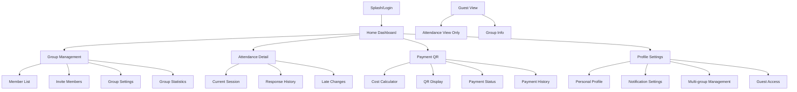
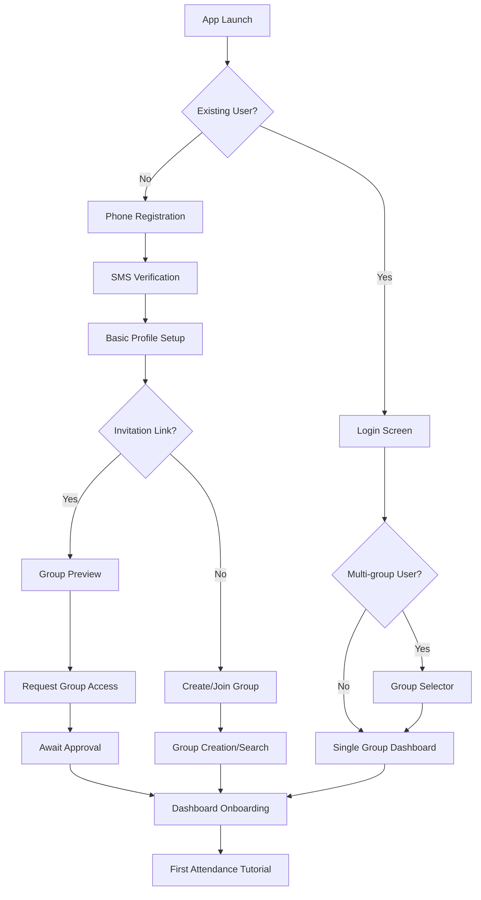
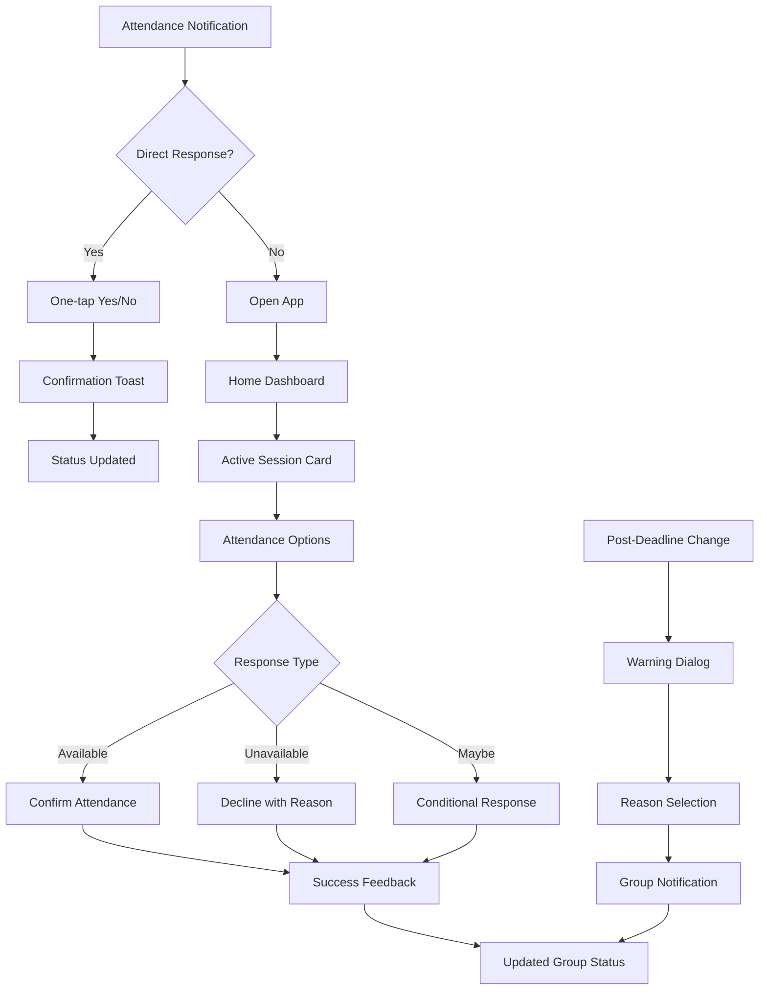
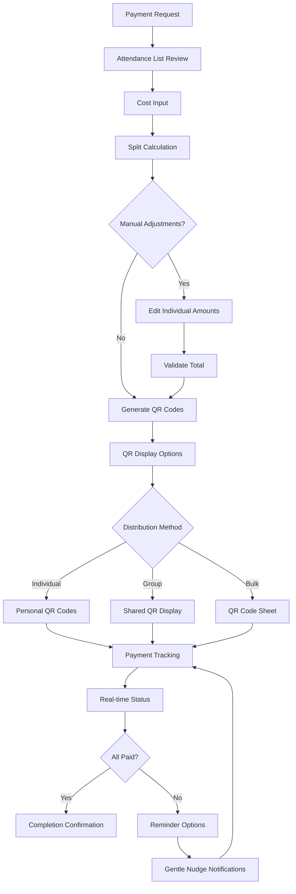
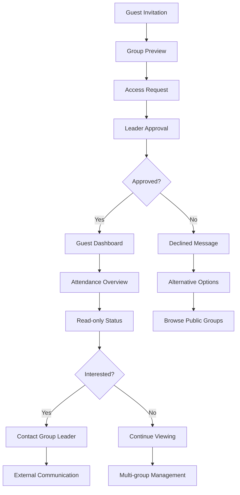

# Go Sport App UI/UX Specification

## Introduction

This document defines the user experience goals, information architecture, user flows, and visual design specifications for Go Sport App's user interface. It serves as the foundation for visual design and frontend development, ensuring a cohesive and user-centered experience.

## Overall UX Goals & Principles

### Target User Personas

**Primary: Vietnamese Sports Group Leaders (Nhóm trưởng, Phó nhóm)**
- Age 25-45, tech-comfortable but efficiency-focused
- Managing 10-30 member groups với 2-4 games/week  
- Pain points: Time-consuming coordination, payment transparency, member reliability
- Success metrics: <10 minute session setup, zero payment disputes

**Secondary: Vietnamese Sports Group Members**  
- Age 22-50, mobile-native với quick interaction preferences
- Participating trong 1-3 groups simultaneously
- Pain points: Unclear costs, complex responses, missed notifications
- Success metrics: One-tap attendance response, clear payment visibility

**Tertiary: Guest Users**
- Occasional participants from other groups
- Need minimal UI complexity với read-only access
- Pain points: Complex navigation, unnecessary features
- Success metrics: Instant attendance visibility, zero learning curve

### Usability Goals

- **Instant Recognition:** Vietnamese sports players can understand core functionality within 30 seconds của app opening
- **One-tap Efficiency:** Critical actions (attendance response, QR generation) accessible trong 1-2 taps from notifications
- **Cultural Familiarity:** Interface patterns match Vietnamese mobile app expectations (banking apps, e-commerce)
- **Role-based Clarity:** UI complexity scales appropriately with user permissions (Guest < Member < Leader)
- **Offline Resilience:** Critical attendance functions work during typical Vietnamese network interruptions

### Design Principles

1. **Vietnamese-first Design** - Language patterns, cultural color meanings, và interaction expectations guide all decisions
2. **Status Transparency** - Game status, member responses, và payment states always visible and unambiguous
3. **Notification-centric Flow** - Primary entry points through push notifications rather than app exploration
4. **Progressive Role Disclosure** - Interface reveals complexity only as user permissions increase
5. **Speed over Beauty** - Functional clarity prioritized over aesthetic innovation for time-sensitive coordination

### Change Log

| Date | Version | Description | Author |
|------|---------|-------------|--------|
| 2025-08-28 | v1.0 | Initial UI/UX specification creation | Sally (UX Expert) |

## Information Architecture (IA)

### Site Map / Screen Inventory

### Navigation Structure

**Primary Navigation:** Bottom tab bar với 4 core sections: Home (status overview), Groups (management), Payment (QR tools), Profile (settings)

**Secondary Navigation:** Contextual action bars within each section, floating action buttons cho primary actions (respond to attendance, generate QR)

**Breadcrumb Strategy:** Minimal breadcrumbs only trong deep management flows (Group → Members → Member Detail), otherwise rely on clear screen titles và back buttons

## User Flows

### User Registration & Onboarding Flow

**User Goal:** Create account và join first sports group quickly với minimal friction

**Entry Points:** App download, invitation link click, phone number invitation

**Success Criteria:** Account created, first group joined, understands basic attendance response within 3 minutes

#### Flow Diagram

#### Edge Cases & Error Handling:
- SMS không nhận được: Resend option với rate limiting, alternative verification methods
- Invalid invitation link: Clear error message với option to browse public groups
- Group approval pending: Status indicator với estimated wait time
- Network during onboarding: Offline capability với sync when connected

**Notes:** Onboarding minimizes steps while ensuring users understand core value proposition. Progressive disclosure introduces advanced features after basic usage established.

### Daily Attendance Response Flow

**User Goal:** Respond to attendance notification quickly và confidently

**Entry Points:** Push notification, home dashboard attendance card, direct app opening

**Success Criteria:** Attendance status updated, user sees confirmation, group status reflects change

#### Flow Diagram

#### Edge Cases & Error Handling:
- Network failure during response: Offline queueing với sync indicators
- Duplicate notifications: Deduplication logic với clear status display
- Response deadline passed: Warning với explanation of impact
- Group status change during response: Real-time updates với new recommendations

**Notes:** Flow prioritizes speed với clear feedback. Advanced options (conditional responses, reason codes) available but không obstruct basic flow.

### Payment QR Generation & Tracking Flow

**User Goal:** Generate fair payment requests và track completion transparently

**Entry Points:** Payment tab, post-game dashboard prompt, group management

**Success Criteria:** Accurate cost splits calculated, QR codes generated, payment status visible

#### Flow Diagram

#### Edge Cases & Error Handling:
- Attendance changes after QR generation: Automatic recalculation với notification
- Payment gateway failures: Fallback methods với clear error messages
- Partial payments: Tracking với options for handling remainders
- Overpayments: Refund workflow hoặc credit towards next session

**Notes:** Transparency emphasized throughout với real-time status updates. Multiple payment methods accommodate diverse user preferences.

### Inter-Group Guest Access Flow

**User Goal:** View attendance status của other groups để coordinate backup players

**Entry Points:** Invitation link, direct group sharing, search functionality

**Success Criteria:** Guest access granted, attendance visibility achieved, no confusion about permissions

#### Flow Diagram

#### Edge Cases & Error Handling:
- Guest access revoked: Graceful degradation với explanation
- Multiple guest roles: Clear role indicators và permission boundaries
- Guest attempting restricted actions: Helpful guidance về limitations
- Guest upgrade requests: Clear pathway to full membership

**Notes:** Guest experience carefully scoped để provide value without complexity. Clear visual indicators distinguish guest permissions throughout interface.

## Wireframes & Mockups

**Primary Design Files:** To be created in Figma - Vietnamese mobile UI patterns library

### Key Screen Layouts

#### Home Dashboard (Primary User Entry Point)

**Purpose:** Real-time game status overview với quick access to critical actions

**Key Elements:**
- Status header: Next game countdown với attendance progress bar
- Quick response buttons: Large, culturally-appropriate ✅/❌ options
- Member status grid: Visual attendance overview với clear indicators
- Payment status card: Current cost splits với payment completion status
- Notification feed: Recent updates với contextual actions

**Interaction Notes:** Designed for thumb navigation với primary actions trong bottom screen third. Status information uses Vietnamese cultural color coding.

**Design File Reference:** [To be created - Figma Home Dashboard wireframes]

#### Group Management (Leader/Co-leader Interface)

**Purpose:** Comprehensive group administration với member oversight

**Key Elements:**
- Member list với roles, activity indicators, và quick actions
- Invitation tools: Link generation, phone invitation, batch operations
- Group statistics: Attendance patterns, payment trends, engagement metrics
- Settings panel: Notification timing, cost rules, permission management

**Interaction Notes:** Progressive disclosure hides complexity until needed. Bulk operations available but không cluttering individual member interactions.

**Design File Reference:** [To be created - Figma Group Management screens]

#### Payment QR Interface (Cost Coordination)

**Purpose:** Transparent payment coordination với minimal manual calculation

**Key Elements:**
- Attendance confirmation list: Final member roster với cost calculations
- Cost input form: Venue, equipment, other expenses với smart defaults
- QR display options: Individual codes, group displays, export functionality
- Payment tracking dashboard: Real-time completion status với reminder tools

**Interaction Notes:** Emphasizes transparency với clear cost breakdowns. QR codes optimized cho Vietnamese payment app scanning.

**Design File Reference:** [To be created - Figma Payment Flow designs]

#### Guest Access View (Simplified Interface)

**Purpose:** Read-only attendance visibility với minimal navigation complexity

**Key Elements:**
- Group information header: Basic details about sport, timing, location
- Attendance status display: Member responses với clear visual indicators
- Contact information: Ways to reach group leaders if interested
- Limited navigation: Only essential functions visible

**Interaction Notes:** Deliberately constrained interface prevents confusion about permissions. Clear upgrade path to full membership if desired.

**Design File Reference:** [To be created - Figma Guest Interface mockups]

## Component Library / Design System

**Design System Approach:** Create custom Vietnamese sports app design system based on familiar banking app patterns với sports-specific enhancements

### Core Components

#### Status Indicator Components

**Purpose:** Consistent visual communication của game, payment, và member states

**Variants:**
- Game status: Confirmed (green), At Risk (yellow), Cancelled (red), Pending (gray)
- Payment status: Paid (green check), Pending (yellow clock), Overdue (red warning)
- Member status: Attending (green), Declined (gray), Late (yellow), No Response (red outline)

**States:** Default, hover, pressed, disabled, loading

**Usage Guidelines:** Always pair với text labels cho accessibility. Use Vietnamese-appropriate color cultural meanings.

#### Action Button Components

**Purpose:** Primary actions throughout app với emphasis on thumb-friendly interaction

**Variants:**
- Primary: Attendance responses, QR generation (high contrast, large touch targets)
- Secondary: Navigation, settings, information (standard sizing)
- Destructive: Member removal, group deletion (red với confirmation patterns)

**States:** Default, pressed, loading, disabled, success feedback

**Usage Guidelines:** Minimum 48px touch targets, clear loading states, immediate feedback for all interactions.

#### Notification Card Components

**Purpose:** Information display trong feeds, dashboards, và status updates

**Variants:**
- Urgent: Payment reminders, game changes (prominent styling)
- Informational: Member joins, system updates (subtle styling)  
- Success: Actions completed, payments received (positive reinforcement)

**States:** Unread, read, dismissed, actionable (with buttons)

**Usage Guidelines:** Support Vietnamese text lengths, clear hierarchy, accessible color ratios throughout.

#### Form Input Components

**Purpose:** Data collection trong registration, group setup, cost entry

**Variants:**
- Text inputs: Standard, phone number, currency (with Vietnamese formatting)
- Selection: Dropdowns, radio buttons, checkboxes (sport types, member roles)
- Time/Date: Vietnamese calendar integration, timezone handling

**States:** Empty, focused, filled, error, success, disabled

**Usage Guidelines:** Support Vietnamese character input, cultural number formatting, clear validation messaging.

## Branding & Style Guide

### Visual Identity

**Brand Guidelines:** Clean, trustworthy sports community platform reflecting Vietnamese cultural preferences for functional clarity

**Design Reference:** Modern fitness/sports app design với bold gradient backgrounds, clean white cards, vibrant CTA buttons - perfectly suited cho Vietnamese sports group coordination context

### Color Palette

**Inspired by modern fitness app design với Vietnamese sports adaptations:**

| Color Type | Hex Code | Usage | Design Reference |
|------------|----------|-------|------------------|
| Primary Blue | #4A90E2 | Main actions, navigation, primary CTA buttons | Fitness app blue gradient start |
| Primary Blue Deep | #2E5BDA | Gradient backgrounds, pressed states | Fitness app blue gradient end |
| Secondary Orange | #FF8A50 | Attention, schedule highlights, secondary actions | Fitness app orange gradient start |
| Secondary Orange Deep | #FF6B35 | Warning states, accent elements | Fitness app orange gradient end |
| Success | #4CAF50 | Attendance confirmed, payments completed | Green confirmations |
| Warning | #FFC107 | Pending responses, deadline warnings | Yellow attention states |
| Error | #F44336 | Declined attendance, payment issues | Red error states |
| Card White | #FFFFFF | Card backgrounds, content containers | Clean white cards from reference |
| Text Primary | #1A1A1A | Headlines, primary text | High contrast on white cards |
| Text Secondary | #666666 | Supporting text, metadata | Secondary information hierarchy |
| Purple Accent | #8B5CF6 | Secondary CTA buttons, tags | Purple "Start" buttons from reference |

### Typography

#### Font Families
**Fitness app-inspired typography system adapted cho Vietnamese language:**

- **Primary:** Inter Bold (fitness app bold headlines equivalent - excellent Vietnamese diacritic support)
- **Secondary:** Inter Regular (clean body text, readable on white cards)
- **Display:** Inter ExtraBold (large impact headlines like "Today's Game Status")
- **Monospace:** SF Mono, Roboto Mono (phone numbers, scores, timestamps)

**Typography Philosophy:** Bold, impactful headlines với clean readable body text - inspired by fitness app's strong hierarchy and Vietnamese readability needs

#### Type Scale

**Inspired by fitness app's bold typography hierarchy:**

| Element | Size | Weight | Line Height | Usage Example |
|---------|------|--------|-------------|---------------|
| Display | 32px | 800 | 1.1 | "Today's Game Status" (main headlines) |
| H1 | 28px | 700 | 1.2 | Game titles, section headers |
| H2 | 20px | 600 | 1.3 | Card titles, member names |
| H3 | 18px | 500 | 1.4 | Sub-sections, categories |
| Body | 16px | 400 | 1.5 | Descriptions, content text |
| Small | 14px | 400 | 1.4 | Metadata, timestamps, counts |
| Button | 16px | 600 | 1.2 | CTA buttons, action text |

### Iconography

**Icon Library:** Phosphor Icons (consistent style, excellent sports icons, Vietnamese-friendly)

**Usage Guidelines:** Minimum 24px sizes cho touch targets, consistent stroke width, pair với text labels for clarity

### Spacing & Layout

**Grid System:** 4px base grid với 16px rhythm for Vietnamese text comfortable reading (Pinterest-inspired spacing system)

**Spacing Scale:** 4, 8, 16, 24, 32, 48, 64px progression for consistent rhythm

**Design Language Enhancements từ Fitness App Reference:**
- **Bold gradient backgrounds** cho main screens và headers (blue to deep blue, orange to deep orange)
- **Clean white cards** với 16px rounded corners và subtle shadows
- **Vibrant CTA buttons** với strong colors (blue, purple) và rounded pill shapes
- **Card-based layouts** với consistent spacing và image + text combinations
- **Horizontal scrolling elements** cho date pickers và category selection
- **High contrast text** on colorful backgrounds for excellent readability
- **Floating elements** như profile avatars và notification badges

## Accessibility Requirements

### Compliance Target

**Standard:** WCAG 2.1 AA compliance với Vietnamese language support

### Key Requirements

**Visual:**
- Color contrast ratios: 4.5:1 minimum for normal text, 3:1 for large text
- Focus indicators: 2px solid outlines với high contrast colors
- Text sizing: Support up to 200% zoom without horizontal scrolling

**Interaction:**
- Keyboard navigation: Full app navigation without mouse/touch required
- Screen reader support: Proper ARIA labels, heading structure, landmark roles
- Touch targets: Minimum 48px với adequate spacing between interactive elements

**Content:**
- Alternative text: Descriptive alt text cho all informational images, decorative images marked appropriately
- Heading structure: Logical H1-H6 hierarchy reflecting information architecture
- Form labels: Clear, descriptive labels với error messages linked to inputs

### Testing Strategy

Regular testing với Vietnamese screen readers, keyboard-only navigation, color blindness simulation, và zoom testing up to 200%

## Responsiveness Strategy

### Breakpoints

| Breakpoint | Min Width | Max Width | Target Devices |
|------------|-----------|-----------|----------------|
| Mobile | 320px | 767px | Vietnamese smartphone majority (Android mid-range) |
| Tablet | 768px | 1023px | Occasional tablet usage, landscape phones |
| Desktop | 1024px | 1439px | Web dashboard (future), laptop usage |
| Wide | 1440px | - | Desktop monitors (minimal priority) |

### Adaptation Patterns

**Layout Changes:** Single-column mobile → two-column tablet → three-column desktop for management interfaces

**Navigation Changes:** Bottom tabs mobile → side navigation tablet/desktop, collapsible member lists

**Content Priority:** Status information first on mobile, detailed statistics visible on larger screens

**Interaction Changes:** Touch-optimized mobile → hover states desktop, contextual menus adapt to input method

## Animation & Micro-interactions

### Motion Principles

Subtle, purposeful animations that enhance understanding without causing distraction. Vietnamese users prefer functional over decorative motion.

### Key Animations

**Pinterest-inspired motion system với functional Vietnamese preferences:**

- **Status Updates:** Smooth color transitions for attendance changes (300ms, ease-out) - Pinterest's refined state changes
- **Button Feedback:** Subtle scale feedback on touch (120ms, ease-out) - Pinterest's gentle interaction style  
- **Screen Transitions:** Smooth slide transitions for navigation (280ms, ease-in-out) - Pinterest's polished navigation
- **Loading States:** Clean skeleton screens với gentle pulsing (1000ms cycle) - Pinterest's loading patterns
- **Success Confirmations:** Refined check mark animations (350ms, ease-out) - Pinterest's success feedback
- **Error Indications:** Gentle shake for invalid inputs (180ms, ease-out) - Pinterest's subtle error handling
- **Hover States:** Soft color overlays mirroring Pinterest's sophisticated interaction feedback
- **Card Elevations:** Subtle shadow transitions on interaction (200ms, ease-out)

## Performance Considerations

### Performance Goals

- **Page Load:** <2 seconds on 3G Vietnamese networks
- **Interaction Response:** <100ms for touch feedback
- **Animation FPS:** Consistent 60fps on mid-range Android devices

### Design Strategies

Optimize for Vietnamese network conditions với progressive image loading, efficient icon usage, minimal animation complexity during network operations

## Next Steps

### Immediate Actions

1. **Create detailed Figma designs** based on fitness app design reference với bold gradients, white cards, và vibrant CTA buttons
2. **Establish fitness app-inspired design system** với Vietnamese sports adaptations trong development-ready format
3. **Validate bold visual aesthetic** với Vietnamese sports community preferences (gradient backgrounds, strong CTAs)
4. **Create component library** mirroring fitness app's card layouts, button styles, và typography hierarchy
5. **Conduct user testing** của fitness-inspired interface với target demographic
6. **Review accessibility compliance** with high contrast text on gradient backgrounds, ensuring Vietnamese readability

### Design Handoff Checklist

- [✓] All user flows documented
- [✓] Component inventory complete  
- [✓] Accessibility requirements defined
- [✓] Responsive strategy clear
- [✓] Brand guidelines incorporated
- [✓] Performance goals established

## Checklist Results

*UI/UX specification checklist results will be populated after comprehensive review*